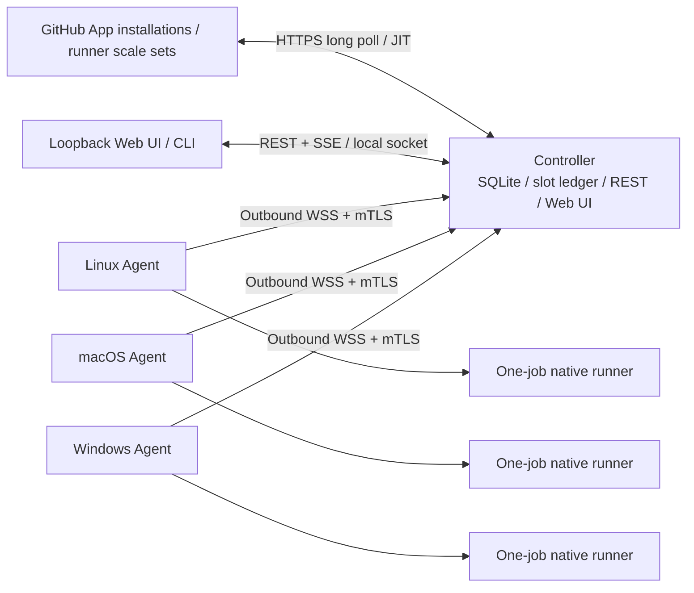
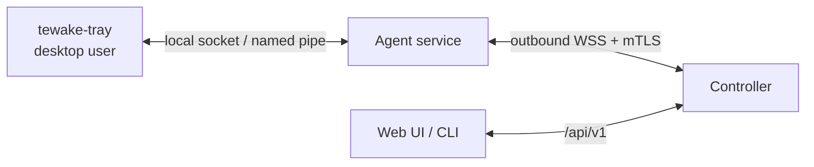

# Tewake Design

Status: accepted for implementation

Feature ID: `tewake`

## Context

Today a developer must download, register, configure, and supervise GitHub Actions
runners independently on every computer and for every repository or organization.
Tewake turns persistent computers the user already owns into a host-centric fleet.
It does not provision or destroy infrastructure instances.

The first release is LAN-first, single-admin, and optimized for trusted private
workflows. It deliberately stays smaller than ARC or GARM while reusing GitHub's
official scale-set and runner implementations.

## Architecture



### Authority boundaries

- **GitHub** owns job assignment, runner scale sets, and external runner
  registration.
- **Controller SQLite** owns configuration, GitHub Targets, Nodes, slot grants,
  desired executions, scheduler decisions, deduplication, and audit events.
- **Agent journal and OS runtime** own observed runner processes, runtime directories,
  cleanup results, and the local truth required during controller outages.

No component claims another component's observations as fact without reconciliation.

### Repository layout

```text
api/                     OpenAPI source and generated boundary
cmd/tewake/              Controller and operator CLI entrypoint
cmd/tewake-agent/        Node service entrypoint
cmd/tewake-tray/         Optional per-user desktop tray client
internal/
  agent/                 Local reconciliation and command handling
  nodectl/               Local control endpoint and node availability intent
  api/                   Management handlers and SSE
  domain/                Shared states and invariants
  enroll/                One-time enrollment and PKI
  github/                actions/scaleset adapter
  reconcile/             Controller recovery and epoch logic
  runner/                Native runner lifecycle and package cache
  scheduler/             Node-affined slot ledger and placement
  store/                 Controller and agent SQLite stores
  transport/             Versioned WebSocket protocol
packaging/               systemd, launchd, Windows Service, installers
spec/tewake/             Requirements, design, and task graph SSOT
web/                     React management UI
```

## Stack

| Layer | Choice |
|---|---|
| Runtime | Go 1.26.5 pinned with `mise`; one Go module |
| GitHub | `github.com/actions/scaleset` v0.4.0 behind `internal/github` |
| CLI | Cobra |
| Daily commands | `just`; Process Compose for local processes; lefthook for local gates |
| Agent transport | `net/http`, `coder/websocket`, node certificates, mDNS discovery |
| Node-local control | Unix domain socket or Windows named pipe with OS peer-identity checks; optional cgo tray binary built natively per platform |
| Management API | Contract-first `/api/v1` OpenAPI; generated Go and TypeScript types; SSE |
| Storage | SQLite WAL with `database/sql` and a pure-Go driver; separate controller and agent DBs |
| UI | React, TypeScript, Vite, pnpm; generated static output embedded into the Go binary |
| Tests | Go tests, Vitest, Playwright Component Testing, limited browser E2E |
| Observability | `slog` JSON, health, Prometheus metrics, audit events |
| Distribution | GoReleaser, GitHub Releases, checksums, SBOM, attestations, native service packages |

Nx/Turborepo, gRPC/protobuf, Postgres, Redis, an OpenTelemetry backend, and
Storybook are not used. The current graph, protocol volume, and deployment shape do
not justify them.

## Domain Model

### Node

A persistent enrolled computer. Stable fields include immutable `NodeID`, display
name, certificate serial/epoch, OS, architecture, configured `maxRunners`, and
administrative state. Observed fields include heartbeat time, available memory, CPU
usage, runner package cache, running executions, and reconciliation status.

Node administrative states are:

```text
Active | Draining | Quarantined | Revoked
```

Node observed states are:

```text
Online | Offline | Stale | Reconciling
```

A node additionally carries a node-local availability intent owned by the node owner:

```text
Accepting | Stopped
```

The intent is durable on the node and is reported to the controller as observed
state. Effective admission is the conjunction of the administrative state and the
intent, so the intent can only subtract capacity.

### GitHub Target

```text
GitHub Target =
  installation + repository/organization scope + scale set + runner profile
```

One scope has a default `tewake` profile. OS-fixed profiles use distinct scale-set
names: `tewake-linux`, `tewake-macos`, and `tewake-windows`. The first release does
not depend on custom multi-label routing.

Target creation verifies private visibility and safe runner-group access. A
repository-level target and organization-level target may not route the same
repository/label pair.

### Runner Profile

A profile owns the externally visible scale-set label and internal platform
requirements:

- label / scale-set name
- optional OS and architecture
- optional minimum available memory
- runner version/update policy
- native runtime only in the first release

### Slot and grant

A node has concrete slot identities from 0 to `maxRunners - 1`. A slot is either free
or owned by exactly one reservation/execution. The scheduler may temporarily grant a
free slot to one GitHub Target when advertising `maxCapacity`.

The fleet maximum is optional. If absent, it equals the sum of node maxima. Capacity
advertised to all Targets is backed by concrete non-overlapping slots, preventing
several organizations from counting the same computer simultaneously.

### Execution

```text
Pending -> Reserved -> Preparing -> Running -> Cleaning -> Released
                    \-> Failed              \-> CleanupFailed -> Quarantined
```

Terminal states never transition back into active states. A cleanup failure also
quarantines its node before the slot can be reused.

## Scheduling

Free slots are granted among eligible Targets using deterministic round-robin.
Weighted fairness, aging, and resource vectors are intentionally absent.

Node selection:

1. retain online, reconciled, active, non-quarantined nodes whose last reported
   availability intent is `Accepting` and whose OS/architecture matches;
2. enforce optional minimum available memory;
3. sort by active runner count ascending;
4. sort by available memory descending;
5. prefer a cached runner package;
6. break ties by immutable Node ID.

CPU usage is observability data, not a capacity dial. `maxRunners` is the safety
boundary; memory is a filter and score.

## GitHub Integration

The adapter owns the pinned Public Preview dependency and exposes Tewake domain
types. It uses low-level poll and acknowledgement operations so message processing
order remains explicit.

1. Poll a scale-set message session.
2. Deduplicate by `(scaleSetID, messageID)`.
3. In one SQLite transaction, persist the message, slot reservation, and desired
   execution.
4. Commit.
5. Acknowledge with `DeleteMessage`.
6. Prepare the runtime and generate JIT configuration only when the selected agent is
   ready.

Tewake never writes the JIT body to Controller SQLite, the Agent journal, logs, or
diagnostics; only a digest and delivery state are retained. The official runner's
current interface receives the body through `--jitconfig`, decodes it, and writes
configuration and credential files below the runner root. The entire
execution-specific runner root is therefore secret-bearing runtime material whose
verified removal is part of correctness, rather than an in-memory-only guarantee.
GitHub's current assigned-job total is the scaling signal rather than summing a
potentially truncated message list.

The adapter preserves last-known data on transient errors and exposes staleness
metadata. It never converts an external 5xx into an empty successful snapshot.

## Enrollment and PKI

`tewake init` creates a controller CA/identity, controller database, management
session secret, and first one-time join code.

A join code encodes:

- protocol version
- controller certificate fingerprint
- optional endpoint hints
- a cryptographically random one-time secret

Only a keyed digest of the secret is stored. An unused code expires on atomic
consumption, explicit cancellation, or the next controller process epoch. To make
a lost enrollment response recoverable, atomic consumption replaces the unused
token with a pending replay row bound to the exact token digest and node public-key
digest. That row survives controller restart and may return only the original
certificate to the same token/key pair. It is deleted after the first successfully
authenticated WSS upgrade. Explicit cancellation of a pending issued response
revokes that node credential before deleting the replay row. The design does not
add an arbitrary wall-clock expiration unless clipboard/process exposure is
measured and an operator-configurable lifetime is specified.

mDNS `_tewake._tcp.local` provides endpoint candidates only. Before sending the join
secret, the agent validates the fingerprint from the code. The agent generates its
key locally; the controller certificate binds immutable `NodeID` with `clientAuth`
usage. After enrollment, the node only creates outbound WSS+mTLS sessions.

The self-signed controller CA defaults to ten years, while controller and node leaf
certificates default to one year. These defaults follow the established kubeadm
validity split and avoid making root rotation an annual fleet-wide recovery event.
Leaf renewal occurs at a random point between 70% and 90% of the certificate
lifetime, following the kubelet rotation window's precedent. Renewal authenticates
with the still-valid current node credential, preserves `NodeID`, issues a new
serial, and atomically supersedes the old serial. CA rollover is an explicit,
separately specified fleet operation rather than a silent trust-anchor replacement.

Revocation increments the node credential epoch, rejects old certificate serials,
terminates active sessions, discards queued commands, and prevents capacity
advertisement.

## Agent Protocol

```json
{
  "protocolVersion": 1,
  "messageId": "opaque-id",
  "type": "hello|snapshot|heartbeat|start|cancel|execution_update|log|ack",
  "payload": {}
}
```

Every controller command contains:

- `CommandID`
- `ControllerEpoch`
- `ExecutionID`
- `ExpectedState`
- command-specific payload digest

The agent journal rejects a repeated command ID with a different payload. Local
operations are idempotent:

- `EnsurePrepared`
- `EnsureRunning`
- `Inspect`
- `Destroy`

Runner-journal records carry a monotonically increasing storage revision. Creating
an execution is an insert-only `Preparing` claim made before its execution root is
created; every later lifecycle mutation is a compare-and-swap against the revision
that was loaded. This storage contract, rather than an in-process mutex, ensures
that overlapping agent instances cannot both transition one execution from
`Prepared` to `Starting`. Only the CAS winner may receive JIT material or start the
runner. Each revision also stores a random mutation token. After a write-then-error,
the caller accepts the mutation as its own only when a reload proves the exact next
revision, token, and record; an identical record written under another token remains
a reconciliation error. A stale writer never becomes the runtime owner merely
because its desired value matches.

Protocol version mismatch is an explicit error before 1.0. Future WAN transport is
limited to internal `PeerID`, discovery, and authenticated-session interfaces;
Iroh-specific types or binaries are absent.

## Native Runner Lifecycle

The agent uses a dedicated service account and OS process containment:

- systemd cgroup on Linux
- an exclusive non-login user per concrete runner slot on macOS, with launchd
  owning the root agent service
- Job Object and Windows Service recovery on Windows

A macOS process group is only a cleanup aid: a workflow can call `setsid()` and
leave that group. Strong macOS admission therefore requires an exclusive slot UID
whose complete process inventory can be terminated and proven empty after restart.
Hosts where that account boundary cannot be established fail closed rather than
claiming launchd process-group ownership is sufficient.

Runtime directories are created below a node-owned root using directory handles and
validated descendants; symlinks and traversal outside the root are rejected.
Runner packages are downloaded from GitHub, checked against the official digest
metadata, and stored as content-addressed archives. The cache root must already
exist as an absolute, service-owned `0700` directory; every original path component
must be a real directory rather than a symlink, and unsafe owners or writable
ancestors fail before download. Cache validation returns a single-use capability
holding the exact open archive object whose manifest, regular-file identity, exact
size, and SHA-256 were checked. The Agent extracts from that same object into the
execution-specific directory, so a later cache path rename, symlink retarget, or
directory-entry replacement cannot substitute executable input.

Preparation captures a typed, opaque platform workspace identity containing a
versioned backend and canonical owner value. The Cleaner and Supervisor must name
the same workspace backend before runner preparation can begin. The core
re-observes that identity on replay, before claiming `Starting`, and inside the
one-shot JIT callback. The platform supervisor receives both the durable identity
and a runtime-only verifier, and must invoke the verifier while holding its start
fence immediately before exec. A replacement, missing directory, backend mismatch,
or unverifiable identity starts no process and quarantines the execution.

Every `Starting` claim carries a unique fence token. Platform `Start` and `Stop`
linearize on the complete containment reference and that token. After `Stop`
returns success, an in-flight or future `Start` for the same token cannot create a
process and returns a fenced error; when `Start` linearizes first, `Stop` must prove
the resulting descendant boundary empty before returning. This closes both
stop-before-start and start-before-running-journal races across Agent managers.
Likewise, only the Manager that wins the revisioned `Cleaning` claim performs
destructive teardown; overlapping managers return reconciliation instead of racing
the same workspace. Once absence is verified, a transient or ambiguous terminal
journal write is resolved before the slot can become `Released` or `Failed`.

The runtime is prepared before JIT generation. The Agent passes the opaque value to
the platform Supervisor through a synchronous one-shot callback with no raw
accessor. The Supervisor consumes it only after the workspace and start fence are
validated, then supplies it to the official runner through the required
`--jitconfig` argument; the official runner writes the decoded settings,
credentials, and RSA material into its root. After one job, the agent first fences
and stops the entire process tree, even when the workspace identity is missing or
mismatched. It only removes the runner configuration, diagnostics subject to
explicit retention policy, workspace, and execution directory after the expected
identity is re-observed, then verifies absence. Tewake does not claim that a Go
string, process argument, or official runner memory can be zeroized. Failure to
verify filesystem and process cleanup is a capacity-blocking quarantine.

The JIT lease records the required verify-then-deliver order. Delivery before the
exec-boundary workspace check invokes no consumer, a failed check permanently
revokes the lease, and a second delivery is rejected. Immediately when
`Supervisor.Start` returns, the core atomically requires completed verification and
synchronous delivery, then revokes every retained `StartRequest` copy. A platform
adapter that returns success without delivery or leaves delivery running
asynchronously is stopped and cleaned as a failed start; it cannot consume the
credential later.

Once the JIT callback has entered `Start`, any callback, spawn, or journal failure
first stops the fenced containment and transitions through `Cleaning`; it removes
and verifies the whole execution root before recording `Failed`. Such a root never
rolls back to `Prepared`, because the official runner may already have materialized
credential files even when process start reports an error.

Native mode narrows accidental blast radius; it is not a sandbox for malicious code.
Host credentials, sockets, interactive users, and personal data must not be
available to the dedicated runner account.

## Management API and UI

The API is versioned under `/api/v1`. CLI and Web UI use the same contract. The API
provides:

- setup and GitHub App Manifest lifecycle
- node inventory, join-code creation/cancellation, drain/resume, revoke, and the
  node-reported availability intent with its observation age
- target and runner-profile configuration
- execution history and audit events
- controller settings and non-secret YAML export/apply
- health, version, and staleness metadata

Live list state uses SSE rather than a second browser WebSocket protocol.

The listener binds loopback by default. A single-admin secure cookie is HttpOnly,
SameSite, and Secure when TLS is enabled. Every mutation requires authentication,
CSRF token, matching Origin, and audit persistence. CORS is disabled by default.
Audit persistence failure blocks new high-impact mutations and runner admission.

The API never returns credential material. Configuration apply uses an optimistic
revision and fails on stale input rather than silently overwriting newer state.

## Node Availability Control and Tray Client

The tray is a presentation surface, not a new authority. It shows the node's own
state and toggles one value: whether this computer accepts new jobs.



### Two authorities, one effective value

The controller owns the Node administrative state (`Active`, `Draining`,
`Quarantined`, `Revoked`). The node owner owns the node-local availability intent
(`Accepting`, `Stopped`), stored in the agent database so it survives service restart
and reboot. Admission requires both, and the intent is monotonically restrictive: a
local `Accepting` never overrides a controller `Draining`, `Quarantined`, or
`Revoked`, and never re-admits a node the controller refuses. Reconciliation reports
the intent to the controller as observed state and never rewrites it; the controller's
administrative state is likewise never rewritten by the agent.

That asymmetry defines the degraded behavior. `Stopped` only subtracts capacity, so
the agent applies it locally the moment it is recorded, even with no controller
session. `Accepting` only adds capacity, so it stays `pending` and ineffective until
the controller acknowledges it; the tray shows `pending`, never `accepting`, until
then.

Stopping never touches a running execution. The agent advertises no further capacity,
the running job completes, and normal verified cleanup releases the slot. Cancelling
a running job stays a separate, explicit controller-side operation.

### Local control endpoint

The agent service exposes a same-host control endpoint: a Unix domain socket under a
service-owned directory on Linux and macOS, and a named pipe with an explicit DACL on
Windows. It is never bound to a network address. The agent verifies the peer's OS
identity from the kernel — `SO_PEERCRED` on Linux, `LOCAL_PEERCRED`/`getpeereid` on
macOS, and the client token on the Windows pipe — and authorizes only the configured
node-owner identities. An unauthorized or unidentifiable peer is refused without a
state change.

The endpoint is an allowlist of two operations: read non-secret node status, and set
the availability intent. It exposes no execution logs, JIT material, tokens,
certificates, join codes, or arbitrary command surface, so a compromised desktop
session cannot escalate through the privileged agent beyond withholding this
computer's own capacity.

### Tray client

`tewake-tray` is an unprivileged per-user binary started as a login item: a launchd
LaunchAgent on macOS, an XDG autostart entry on Linux, and a per-user startup entry on
Windows. The agent service never depends on it; a missing, crashed, or never-installed
tray changes no fleet behavior.

It renders exactly what the agent reports — administrative state, connection state,
observation age, intent including `pending`, and the running executions on this node —
plus the on/off toggle and a link to the controller UI. Unreachable agent, stale
observation, and quarantine are distinct explicit presentations; none of them renders
as accepting or idle.

Linux has no universal tray. The client uses StatusNotifierItem where the desktop
provides it and otherwise exits with an explicit unsupported-environment error,
pointing at the CLI. It never degrades into a silent no-op window.

Because tray integration needs cgo on macOS and Linux, `tewake-tray` is a separate
optional artifact built natively per platform and excluded from the pure-Go
cross-build matrix. Controller and agent releases never gate on it, and the support
matrix states which platform packages include it.

### Surface parity and audit

The availability mutation exists once in `/api/v1` and is used by the Web UI, by
`tewake node pause`/`tewake node resume`, and by the tray through the agent. Each
change persists an audit event with node ID, requesting surface, actor identity,
previous and next value, and result.

## Secret Storage

- macOS: Keychain
- Windows: DPAPI/CNG-protected material scoped to the service identity
- Linux: systemd credentials or a service-user-only credential file with explicit
  permissions and no environment-variable transport

GitHub App private keys, controller signing keys, management session secrets, and
node private keys never enter SQLite. `.env` files are unsupported. Diagnostics use
an allowlist of safe structured fields rather than a denylist of secret names.
Secret-store unavailability blocks new runner admission.

## Recovery and Reconciliation

Each controller process start advances a durable `ControllerEpoch` and sets advertised
capacity to zero. Connected nodes provide snapshots of local journal state and
observed runtimes. The controller reconciles each node independently:

- matching active execution: adopt observation and restore backed capacity;
- controller desired execution absent locally: retry idempotent command or fail it;
- local runtime absent from controller: inspect and destroy before capacity returns;
- cleanup tombstone: keep node quarantined until explicit successful remediation;
- reported availability intent: adopt it as observed state, apply it to capacity, and
  never replace it with a controller-side default;
- offline node: retain last-known state and do not block reconciliation of other
  nodes.

Agent disconnection does not kill an already-running job. The local agent retains
ownership of cleanup and reports the result after reconnect. Controller downtime
prevents new starts but does not turn known running jobs into an empty state.

## Failure Handling

| Failure | Behavior |
|---|---|
| GitHub 5xx/timeout | retain last-known state, mark stale, advertise no speculative new capacity |
| Duplicate message | return existing desired execution; acknowledge only after durable state |
| Controller crash | advance epoch, capacity zero, reconcile nodes independently |
| Agent offline before start | release only after desired state is reconciled; do not create a second runtime blindly |
| Agent offline during job | continue locally, cleanup locally, reconcile on reconnect |
| Cleanup failure | `CleanupFailed`, node `Quarantined`, capacity zero |
| Secret store failure | runner admission and protected mutations fail closed |
| Node stopped by its owner | withhold capacity immediately; running job completes and cleans up normally |
| Availability intent unreported | controller keeps the last reported intent and marks it stale; resume stays pending |
| Tray cannot reach the agent | present unknown state and an explicit error; confirm no change |
| Unauthorized local control peer | refuse without state change and record an audit event |
| Protocol mismatch | explicit incompatibility error; no backward-compatibility shim pre-1.0 |
| Disk/database failure | preserve error, enter recovery/degraded mode, never synthesize success |

## Observability

- JSON `slog` events with stable event name, component, node/target/execution IDs,
  controller epoch, result, and error class
- `/healthz` for process liveness and `/readyz` for operational readiness
- Prometheus metrics for node states, backed/free slots, execution state, scheduling
  latency, runner startup latency, GitHub polling staleness, reconciliation, and
  cleanup failures
- append-only audit events for enrollment, credential lifecycle, GitHub App/Target
  changes, scheduling decisions, node administrative changes, node availability
  changes with their requesting surface, local control authorization failures, and
  authentication failures
- last-known state contains observation timestamps and explicit stale/offline flags

Logs never include JIT payloads, tokens, keys, authorization headers, workflow
secrets, or raw environment snapshots.

## Testing Strategy

- Table and property tests for transitions, slot uniqueness, deterministic
  round-robin, replay, and serialization invariants
- SQLite, mTLS/WebSocket, OpenAPI, and GitHub adapter integration/contract tests
- Failure injection at DB commit boundaries, GitHub ack boundaries, agent response
  loss, process cleanup, disk errors, and controller restart
- Playwright Component Testing for loading, empty, running, offline, stale,
  permission-error, and quarantined UI states
- Limited browser E2E for setup, join-code management, target creation, and drain
- Real sandbox E2E across Linux/macOS/Windows and at least two GitHub installations
- Security tests for public-scope rejection, token/certificate replay, JIT canaries,
  traversal/symlinks, unauthenticated/CSRF mutation, local control endpoint peer
  authorization, and diagnostics redaction
- Availability tests for durable intent across restart, stop during a running job,
  disconnected stop and pending resume, and the precedence of controller `Draining`,
  `Quarantined`, and `Revoked` over a local `Accepting`

Test evidence is emitted as JSON or JUnit and aggregated by `just check`. Debug
artifacts have explicit short retention and are uploaded only on failure.

## Rollout and Release

Development follows `spec/tewake/tasks.yaml`, one mergeable task per Draft PR and
bottom-up dependency order. Required pull-request CI uses GitHub-hosted runners only;
public fork pull requests never reach personal nodes. Real Tewake fleet smoke runs
only for trusted protected-branch commits and release gates.

The first public tag requires:

- three-OS and two-installation live evidence
- clean-machine install/join/upgrade/uninstall evidence
- signed checksums, SBOM, and artifact provenance
- threat model, security policy, native-isolation limitations, and support matrix

Runner auto-update may be disabled only with an enforced release process that updates
within GitHub's current supported window. Fleet upgrades drain nodes before replacing
controller or agent binaries.

## Primary implementation references

- [GitHub JIT runner configuration REST API](https://docs.github.com/en/rest/actions/self-hosted-runners#create-configuration-for-a-just-in-time-runner-for-an-organization)
- [Official runner JIT decode and file materialization](https://github.com/actions/runner/blob/main/src/Runner.Listener/Runner.cs)
- [GitHub self-hosted runner routing and update windows](https://docs.github.com/en/actions/reference/runners/self-hosted-runners)
- [kubeadm certificate validity defaults](https://kubernetes.io/docs/tasks/administer-cluster/kubeadm/kubeadm-certs/)
- [kubelet certificate rotation window](https://v1-32.docs.kubernetes.io/docs/tasks/tls/certificate-rotation/)

## Risks and Open Questions

- The `actions/scaleset` Go client is Public Preview; only the adapter may absorb its
  source-level churn.
- Stable macOS and Windows releases depend on external signing identities that may
  not be available during development.
- Exact node counts and performance boundaries remain measurement-driven; no
  arbitrary product quota is introduced.
- Native process cleanup cannot prove the host is pristine after malicious code.
  Public/fork execution remains rejected rather than weakened into an opt-in warning.
- Iroh is reconsidered only if WAN/NAT traversal becomes a measured core requirement
  and a supportable official-language boundary plus relay operation exists.
