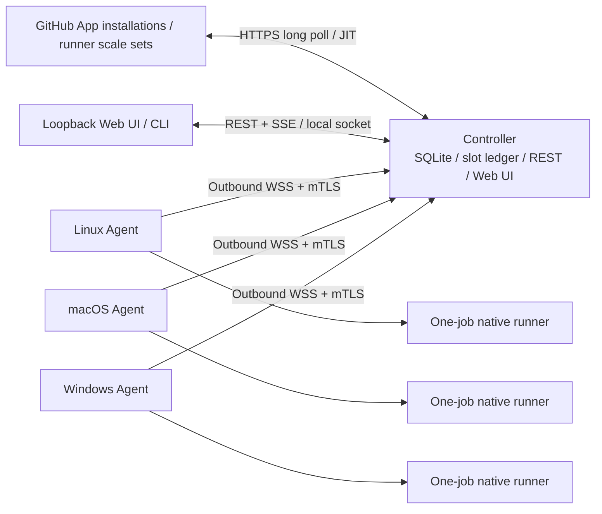
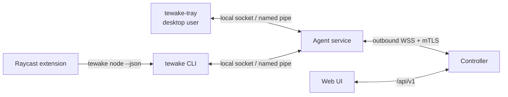

# Tewake Design

Status: accepted for implementation

Feature ID: `tewake`

## Context

Today a developer must download, register, configure, and supervise GitHub Actions
runners independently on every computer and for every repository or organization.
Tewake turns persistent computers the user already owns into a host-centric fleet.
It does not provision or destroy infrastructure instances.

The first release is LAN-first, single-admin, and optimized for trusted private
workflows. It deliberately stays smaller than ARC or GARM while reusing GitHub's
official scale-set and runner implementations.

## Architecture



### Authority boundaries

- **GitHub** owns job assignment, runner scale sets, and external runner
  registration.
- **Controller SQLite** owns configuration, GitHub Targets, Nodes, slot grants,
  desired executions, scheduler decisions, deduplication, and audit events.
- **Agent journal and OS runtime** own observed runner processes, runtime directories,
  cleanup results, and the local truth required during controller outages.

No component claims another component's observations as fact without reconciliation.

### Repository layout

```text
api/                     OpenAPI source and generated boundary
cmd/tewake/              Controller and operator CLI entrypoint
cmd/tewake-agent/        Node service entrypoint
cmd/tewake-tray/         Optional per-user desktop tray client
extensions/raycast/      Optional macOS Raycast extension over the CLI contract
internal/
  agent/                 Local reconciliation and command handling
  nodectl/               Local control endpoint and node availability intent
  api/                   Management handlers and SSE
  domain/                Shared states and invariants
  enroll/                One-time enrollment and PKI
  github/                actions/scaleset adapter
  reconcile/             Controller recovery and epoch logic
  runner/                Native runner lifecycle and package cache
  scheduler/             Node-affined slot ledger and placement
  store/                 Controller and agent SQLite stores
  transport/             Versioned WebSocket protocol
packaging/               systemd, launchd, Windows Service, installers
spec/tewake/             Requirements, design, and task graph SSOT
web/                     React management UI
```

## Stack

| Layer | Choice |
|---|---|
| Runtime | Go 1.26.5 pinned with `mise`; one Go module |
| GitHub | `github.com/actions/scaleset` v0.4.0 behind `internal/github` |
| CLI | Cobra |
| Daily commands | `just`; Process Compose for local processes; lefthook for local gates |
| Agent transport | `net/http`, `coder/websocket`, node certificates, mDNS discovery |
| Node-local control | Unix domain socket or Windows named pipe with OS peer-identity checks; optional cgo tray binary built natively per platform |
| Launcher integration | Optional macOS Raycast extension in TypeScript over the versioned `tewake node --json` contract, with no stored credentials |
| Management API | Contract-first `/api/v1` OpenAPI; generated Go and TypeScript types; SSE |
| Storage | SQLite WAL with `database/sql` and a pure-Go driver; separate controller and agent DBs |
| UI | React, TypeScript, Vite, pnpm; generated static output embedded into the Go binary |
| Tests | Go tests, Vitest, Playwright Component Testing, limited browser E2E |
| Observability | `slog` JSON, health, Prometheus metrics, audit events |
| Distribution | GoReleaser, GitHub Releases, checksums, SBOM, attestations, native service packages |

Nx/Turborepo, gRPC/protobuf, Postgres, Redis, an OpenTelemetry backend, and
Storybook are not used. The current graph, protocol volume, and deployment shape do
not justify them.

## Domain Model

### Node

A persistent enrolled computer. Stable fields include immutable `NodeID`, display
name, certificate serial/epoch, OS, architecture, configured `maxRunners`, and
administrative state. Observed fields include heartbeat time, available memory, CPU
usage, runner package cache, running executions, and reconciliation status.

Node administrative states are:

```text
Active | Draining | Quarantined | Revoked
```

Node observed states are:

```text
Online | Offline | Stale | Reconciling
```

A node additionally carries a node-local availability intent owned by the node owner:

```text
Accepting | Stopped
```

The intent is durable on the node. The Agent applies the conjunction itself: it
advertises native readiness only while the runtime is healthy *and* the owner
accepts, and it reports the intent separately as observed state for display and
audit. Capacity therefore travels one path, and a Controller that ignored the
intent field could still never over-admit because of it.

### GitHub Target

```text
GitHub Target =
  installation + repository/organization scope + scale set + runner profile
```

One scope has a default `tewake` profile. OS-fixed profiles use distinct scale-set
names: `tewake-linux`, `tewake-macos`, and `tewake-windows`. The first release does
not depend on custom multi-label routing.

Target creation verifies private visibility and safe runner-group access. A
repository-level target and organization-level target may not route the same
repository/label pair.

Each scale set is created and exclusively managed by exactly one Tewake Target;
attaching an arbitrary pre-existing or shared scale set is not supported. The
Controller store enforces a unique scale-set-to-Target binding. This ownership
contract is required because GitHub runner records do not expose
`RunnerRequestID`: generation-ambiguity cleanup may use only the deterministic
Tewake runner name inside that exclusively owned scale set, followed by two
durable absence reads before clearing the fence.

### Runner Profile

A profile owns the externally visible scale-set label and internal platform
requirements:

- label / scale-set name
- optional OS and architecture
- optional minimum available memory
- runner version/update policy
- native runtime only in the first release

### Slot and grant

A node has concrete slot identities from 0 to `maxRunners - 1`. A slot is either free
or owned by exactly one reservation/execution. The scheduler may temporarily grant a
free slot to one GitHub Target when advertising `maxCapacity`.

The reservation is an active SQLite lease, not derived best-effort state. Every
non-terminal execution has exactly one matching reservation and every terminal
execution has none. SQLite rejects deletion of an active lease; a terminal update
must delete exactly one lease in the same transaction. Controller startup validates
the complete relation and enters read-only recovery mode if corruption or manual
drift would otherwise make a live slot appear free.

The fleet maximum is optional. If absent, it equals the sum of node maxima. Capacity
advertised to all Targets is backed by concrete non-overlapping slots, preventing
several organizations from counting the same computer simultaneously.

### Execution

```text
Pending -> Reserved -> Preparing -> Running -> Cleaning -> Released
                    \-> Failed              \-> CleanupFailed -> Quarantined
```

Terminal states never transition back into active states. A cleanup failure also
quarantines its node before the slot can be reused.

## Scheduling

Free slots are granted among eligible Targets using deterministic round-robin.
Weighted fairness, aging, and resource vectors are intentionally absent.

Node selection:

1. retain online, reconciled, active, non-quarantined nodes that currently
   advertise native readiness and whose OS/architecture matches;
2. enforce optional minimum available memory;
3. sort by active runner count ascending;
4. sort by available memory descending;
5. prefer a cached runner package;
6. break ties by immutable Node ID.

CPU usage is observability data, not a capacity dial. `maxRunners` is the safety
boundary; memory is a filter and score.

## GitHub Integration

The adapter owns the pinned Public Preview dependency and exposes Tewake domain
types. It uses low-level poll and acknowledgement operations so message processing
order remains explicit.

1. Poll a scale-set message session.
2. Deduplicate by `(scaleSetID, messageID)`.
3. In one SQLite transaction, persist the message, slot reservation, and desired
   execution.
4. Commit.
5. Acknowledge with `DeleteMessage`.
6. Prepare the runtime and generate JIT configuration only when the selected agent is
   ready.

Tewake never writes the JIT body to Controller SQLite, the Agent journal, logs, or
diagnostics; only a digest and delivery state are retained. The official runner's
current interface receives the body through `--jitconfig`, decodes it, and writes
configuration and credential files below the runner root. The entire
execution-specific runner root is therefore secret-bearing runtime material whose
verified removal is part of correctness, rather than an in-memory-only guarantee.
GitHub's current assigned-job total is the scaling signal rather than summing a
potentially truncated message list.

The adapter preserves last-known data on transient errors and exposes staleness
metadata. It never converts an external 5xx into an empty successful snapshot.

## Enrollment and PKI

`tewake init` creates a controller CA/identity, controller database, management
session secret, and first one-time join code.

A join code encodes:

- protocol version
- controller certificate fingerprint
- optional endpoint hints
- a cryptographically random one-time secret

Only a keyed digest of the secret is stored. An unused code expires on atomic
consumption, explicit cancellation, or the next controller process epoch. To make
a lost enrollment response recoverable, atomic consumption replaces the unused
token with a pending replay row bound to the exact token digest and node public-key
digest. That row survives controller restart and may return only the original
certificate to the same token/key pair. It is deleted after the first successfully
authenticated WSS upgrade. Explicit cancellation of a pending issued response
revokes that node credential before deleting the replay row. The design does not
add an arbitrary wall-clock expiration unless clipboard/process exposure is
measured and an operator-configurable lifetime is specified.

mDNS `_tewake._tcp.local` provides endpoint candidates only. Before sending the join
secret, the agent validates the fingerprint from the code. The agent generates its
key locally; the controller certificate binds immutable `NodeID` with `clientAuth`
usage. After enrollment, the node only creates outbound WSS+mTLS sessions.

The self-signed controller CA defaults to ten years, while controller and node leaf
certificates default to one year. These defaults follow the established kubeadm
validity split and avoid making root rotation an annual fleet-wide recovery event.
Leaf renewal occurs at a random point between 70% and 90% of the certificate
lifetime, following the kubelet rotation window's precedent. Renewal authenticates
with the still-valid current node credential, preserves `NodeID`, issues a new
serial, and atomically supersedes the old serial. CA rollover is an explicit,
separately specified fleet operation rather than a silent trust-anchor replacement.

Revocation increments the node credential epoch, rejects old certificate serials,
terminates active sessions, discards queued commands, and prevents capacity
advertisement.

## Agent Protocol

```json
{
  "protocolVersion": 1,
  "messageId": "opaque-id",
  "type": "hello|snapshot|heartbeat|prepare|start|cancel|execution_update|log|ack",
  "payload": {}
}
```

Every controller command contains:

- `CommandID`
- `ControllerEpoch`
- `ExecutionID`
- `ExpectedState`
- command-specific payload digest

The agent journal rejects a repeated command ID with a different payload. Local
operations are idempotent:

- `EnsurePrepared`
- `EnsureRunning`
- `Inspect`
- `Destroy`

Before a newly observed command is recorded or acknowledged, the Agent compares
`ExpectedState` with its authoritative local runner observation while holding an
execution-scoped command lock. A command that fails this comparison is not
inserted into the replay journal, so retransmitting an initially rejected command
cannot later acquire authority merely by being classified as a replay. A
previously admitted identical command may resume its idempotent operation after a
crash; a changed payload or a second command whose state precondition is stale is
rejected before JIT delivery, process start, or cleanup.

Runner admission is a two-command exchange. `prepare` carries only the pinned
runner version and non-secret runtime options, expects Controller state
`Reserved`, and invokes `EnsurePrepared`. After the Agent durably reports
`Preparing` with a prepared local workspace, the Controller generates JIT
configuration and sends `start` with expected state `Preparing`. A start command
is never used as an implicit package download or workspace-preparation request.
Once a secret-bearing start command has been durably accepted, its execution is
owned by the Agent process rather than the WebSocket: loss of the command ACK
does not discard the command or cancel the local start. The Controller does not
automatically regenerate or replay JIT after an ambiguous write; reconciliation
first determines whether the Agent journal accepted that exact command.

Runner-journal records carry a monotonically increasing storage revision. Creating
an execution is an insert-only `Preparing` claim made before its execution root is
created; every later lifecycle mutation is a compare-and-swap against the revision
that was loaded. This storage contract, rather than an in-process mutex, ensures
that overlapping agent instances cannot both transition one execution from
`Prepared` to `Starting`. Only the CAS winner may receive JIT material or start the
runner. Each revision also stores a random mutation token. After a write-then-error,
the caller accepts the mutation as its own only when a reload proves the exact next
revision, token, and record; an identical record written under another token remains
a reconciliation error. A stale writer never becomes the runtime owner merely
because its desired value matches.

Protocol version mismatch is an explicit error before 1.0. Future WAN transport is
limited to internal `PeerID`, discovery, and authenticated-session interfaces;
Iroh-specific types or binaries are absent.

## Native Runner Lifecycle

The agent uses a dedicated service account and OS process containment:

- systemd cgroup on Linux
- an exclusive non-login user per concrete runner slot on macOS, with launchd
  owning the root agent service
- Job Object and Windows Service recovery on Windows

On Linux, the outbound network Agent itself runs as an unprivileged
`tewake-agent` account. A separate root-owned local Supervisor service owns the
delegated cgroup subtree, durable start fences, slot-account handoff, and verified
cleanup. The two services communicate only over a root-created Unix socket. The
Supervisor authenticates the Agent with the peer credential supplied by the
kernel, accepts a versioned fixed-operation protocol, and derives every cgroup,
workspace, executable, argument, and runner UID from its local configuration.
It never accepts an arbitrary command, path, environment, UID, or GID from the
network-facing process. Losing the Supervisor or failing any peer, filesystem,
cgroup-v2, or protocol check makes native runner admission unavailable while the
Agent may remain connected for diagnostics.

Every authenticated snapshot carries an explicit `nativeRunnerReady` observation.
The Controller treats a missing or false value as zero capacity even if the Agent
transport is online. Eligibility additionally requires a fresh, reconciled
snapshot; connectivity is not evidence that the local runner backend is usable.

A macOS process group is only a cleanup aid: a workflow can call `setsid()` and
leave that group. Strong macOS admission therefore requires an exclusive slot UID
whose complete process inventory can be terminated and proven empty after restart.
Hosts where that account boundary cannot be established fail closed rather than
claiming launchd process-group ownership is sufficient.

Runtime directories are created below a node-owned root using directory handles and
validated descendants; symlinks and traversal outside the root are rejected.
Runner packages are downloaded from GitHub, checked against the official digest
metadata, and stored as content-addressed archives. The cache root must already
exist as an absolute, service-owned `0700` directory; every original path component
must be a real directory rather than a symlink, and unsafe owners or writable
ancestors fail before download. Cache validation returns a single-use capability
holding the exact open archive object whose manifest, regular-file identity, exact
size, and SHA-256 were checked.

On Linux that Agent cache capability is not privileged launch authority. The root
Supervisor independently fixes the official package for its own platform, opens
the cache object, and copies it to a root-owned execution-local archive while
checking the exact pinned size and SHA-256. It extracts only from that same
root-owned descriptor, removes the temporary archive, and hands the completed
tree to the dedicated runner identity last. At the launch boundary it opens both
the workspace directory and `run.sh`, rechecks their inode, owner, and durable
`WorkspaceRef`, and passes those descriptors to the downgraded launcher. The
launcher changes directory and executes through `/proc/self/fd`; it never reopens
an Agent-writable pathname after verification.

Preparation captures a typed, opaque platform workspace identity containing a
versioned backend and canonical owner value. The Cleaner and Supervisor must name
the same workspace backend before runner preparation can begin. The core
re-observes that identity on replay, before claiming `Starting`, and inside the
one-shot JIT callback. The platform supervisor receives both the durable identity
and a runtime-only verifier, and must invoke the verifier while holding its start
fence immediately before exec. A replacement, missing directory, backend mismatch,
or unverifiable identity starts no process and quarantines the execution.

Every `Starting` claim carries a unique fence token. Platform `Start` and `Stop`
linearize on the complete containment reference and that token. After `Stop`
returns success, an in-flight or future `Start` for the same token cannot create a
process and returns a fenced error; when `Start` linearizes first, `Stop` must prove
the resulting descendant boundary empty before returning. This closes both
stop-before-start and start-before-running-journal races across Agent managers.
Likewise, only the Manager that wins the revisioned `Cleaning` claim performs
destructive teardown; overlapping managers return reconciliation instead of racing
the same workspace. Once absence is verified, a transient or ambiguous terminal
journal write is resolved before the slot can become `Released` or `Failed`.

The runtime is prepared and reported before JIT generation. The Agent passes the
opaque value to the platform Supervisor through a synchronous one-shot callback with no raw
accessor. The Supervisor consumes it only after the workspace and start fence are
validated, then supplies it to the official runner through the required
`--jitconfig` argument; the official runner writes the decoded settings,
credentials, and RSA material into its root. After one job, the agent first fences
and stops the entire process tree, even when the workspace identity is missing or
mismatched. It only removes the runner configuration, diagnostics subject to
explicit retention policy, workspace, and execution directory after the expected
identity is re-observed, then verifies absence. Tewake does not claim that a Go
string, process argument, or official runner memory can be zeroized. Failure to
verify filesystem and process cleanup is a capacity-blocking quarantine.

Linux runner environment state is execution-scoped: `HOME`,
`XDG_CONFIG_HOME`, `XDG_CACHE_HOME`, and `TMPDIR` all resolve below the
descriptor-pinned disposable workspace. The persistent slot-account home is not
writable by the Supervisor service. Removal and absence verification therefore
cover runner credentials and files that honor those home/cache/temp variables.
Native mode does not create a mount namespace per job: a workflow that bypasses
`TMPDIR` and writes an absolute `/tmp` path may leave data visible to a later job
inside the Supervisor service's `PrivateTmp` namespace. This is part of the
trusted-workflow limitation rather than a sandbox guarantee.

After the listener starts, the Agent monitors the complete platform containment
rather than only the listener PID. There is no controller-connection or arbitrary
job-duration timeout: an Agent/WebSocket disconnect leaves the job running. When
the containment becomes empty, `Destroy` first commits the local revisioned
`Cleaning` intent, performs teardown, and commits the terminal local state. Only
the resulting `Released` or `CleanupFailed` observation is then persisted to the
durable Agent outbox before network delivery. The outbox entry is removed only
after a matching Controller acknowledgement, so cleanup and its quarantine result
survive reconnects without exposing a synthetic Controller-side `Cleaning` state
that is ahead of the Agent runtime SSOT, and without retaining raw process output
or JIT material.

The local runner journal and terminal outbox are admission authorities, not
best-effort telemetry. A read, write, or acknowledgement failure in either surface
terminates the Agent process with an explicit degraded error so the OS service can
restart it. Reconnecting forever with an unreadable local authority is forbidden.

The authenticated reconnect snapshot includes the Agent's maximum accepted
Controller epoch, non-secret command replay identities and payload digests,
execution observations, and cleanup tombstones. The Controller commits that
snapshot before activating the session or acknowledging it. This is the evidence
used to resolve an ambiguous secret-bearing command write; absence is never
inferred from a connection alone, and a new JIT configuration is not generated
until the previous command is proven unaccepted or terminal.

An Agent snapshot and its durable outbox have distinct authority. A terminal
snapshot may prove that the local runtime no longer exists, but it does not mutate
the Controller execution to a terminal state or release its slot. The exact
`execution_update` outbox record is the sole owner of those mutations and is
processed in Agent sequence order. Authenticated `CleanupFailed` or `Quarantined`
snapshot evidence may latch the node quarantine before the matching outbox record;
this is a deliberate fail-closed capacity guard, not an alternate terminal-state
owner. A `Released` or `Failed` snapshot without its exact terminal outbox record
does not make the node idle.

Snapshot capture and command dispatch are linearized per Node. The Controller
records a command-sequence baseline before acknowledging `hello`, because the
Agent constructs its journal snapshot only after that acknowledgement. A snapshot
is rejected before the durable snapshot consumer when any command was in flight
at capture start, began during capture, or remains in flight at commit. Snapshot
commit and command dispatch share the same Node lifecycle lock and revalidate the
current projected Agent actor. Therefore a replacement snapshot cannot erase a
command accepted by an older overlapping Agent process, and an older actor cannot
receive a command after a replacement snapshot wins. A newer valid handshake
supersedes an older incomplete capture. Recovery-only Prepare replay additionally
requires the same exact current snapshot digest and Controller epoch in both the
broker and SQLite transaction.

The lifecycle lock covers the atomic full-snapshot store transition, but does not
extend into protocol ACK I/O or disconnect persistence. After snapshot commit
and actor replacement, the snapshot ACK is written without the lock; the actor
remains unavailable for commands until that ACK succeeds, and another handshake
can supersede a stalled write. Disconnect projection records an in-flight fence
under the lock, performs the SQLite consumer call outside it using the Controller
lifetime context, then clears the fence under the lock. A reconnect that arrives
while this projection is unresolved receives an explicit fail-closed error and
may retry; it never waits behind the store call. Controller shutdown cancels the
lifetime context.

For an accepted `start`, only an exact durable `Running` or `Cleaning` Agent update
proves that the official runner actually started. A later `Released`, `Failed`, or
`CleanupFailed` observation without that history instead identifies a lost-JIT
case: local recovery cleaned a prepared runtime after accepting the command but
before a process start was proven. Controller restart and Agent acknowledgement may
prune the Agent-side command and runner journal, so the Controller retains issued
command and execution-update history as the durable source for this distinction.

Lost-JIT provider cleanup is exact and ordered. Tewake queries the runner identity
bound to the original scale set and attempt, removes that runner when present, then
requires two post-removal absence reads separated by the durable confirmation
interval under unchanged Controller, GitHub-session, and Agent-snapshot authority.
The DELETE response itself and any pre-DELETE absence never count as absence
confirmation. Cleanup failure keeps the slot reserved, the node quarantined, and
advertised capacity at zero even after provider absence is proven.

An Agent `Running` update proves that the local runner process started; it does
not prove that GitHub assigned work to that process. Pickup authority is an exact
`JobStarted`, or an exact `JobCompleted` with a known non-`canceled` result, whose
scale set, runner ID, and runner name all match the JIT attempt. Availability and
assignment require a non-zero runner request ID. GitHub lifecycle events may omit
that ID; a non-zero value must match the attempt, while zero may fall back only
when the exact provider runner ID and name identify one durable attempt in the
scale set. A partial unique index on provider runner identity and a single
read-transaction correlation query make ambiguity fail closed.
`JobCompleted(result: "canceled")` is not pickup authority because GitHub emits
that event when a scale-set assignment times out and the job is requeued.

Provider reconciliation never rewinds the old terminal execution or delivers a
second JIT configuration for it. Once the exact terminal outbox update is durable,
a fresh, non-replayed `JobAvailable` from the current poll session persists only
an unpicked-requeue intent: the old terminal execution remains the claim identity,
the proposed replacement ID has no execution row or reservation, and capacity
stays zero. If the fresh availability races ahead of the terminal outbox update,
the whole message transaction is rolled back and left unacknowledged for
redelivery. The same rollback applies while recovery admission is temporarily
disabled, the concrete slot is occupied, or the poll authority is stale; none of
those conditions may consume the one fresh message needed to create or rearm
recovery state.

The Controller commits and acknowledges that intent before touching the provider.
It then performs a zero-capacity poll before the first exact query/delete and
between every destructive or absence-confirmation step. A late exact pickup event
keeps the old claim and discards the proposed replacement. Only two post-removal
absence reads under unchanged Controller, GitHub-session, and Agent-snapshot
authority atomically create the replacement execution, reservation, and next
acquire attempt. That acquire is durably marked `reconciled_pending`, and startup
validates its exact claim, source availability, old JIT absence, and attempt
lineage before driving it ahead of the first long poll. An ordinary pre-ACK
`pending` acquire remains poll-first. This distinction preserves immediate
dispatch even if the Controller stops after the final absence transaction commits
but before the in-memory projection advances. Replayed availability cannot create
an intent or rearm the claim.

The JIT lease records the required verify-then-deliver order. Delivery before the
exec-boundary workspace check invokes no consumer, a failed check permanently
revokes the lease, and a second delivery is rejected. Immediately when
`Supervisor.Start` returns, the core atomically requires completed verification and
synchronous delivery, then revokes every retained `StartRequest` copy. A platform
adapter that returns success without delivery or leaves delivery running
asynchronously is stopped and cleaned as a failed start; it cannot consume the
credential later.

Once the JIT callback has entered `Start`, any callback, spawn, or journal failure
first stops the fenced containment and transitions through `Cleaning`; it removes
and verifies the whole execution root before recording `Failed`. Such a root never
rolls back to `Prepared`, because the official runner may already have materialized
credential files even when process start reports an error.

Native mode narrows accidental blast radius; it is not a sandbox for malicious code.
Host credentials, sockets, interactive users, and personal data must not be
available to the dedicated runner account.

## Management API and UI

The API is versioned under `/api/v1`. CLI and Web UI use the same contract. The API
provides:

- setup state; GitHub App Manifest setup is exposed through a signed, one-use
  callback state and controller-owned credential-store boundary. Native
  Keychain/DPAPI adapters remain platform-task work; Linux uses the service-user
  private credential file boundary until those adapters land
- node inventory, join-code creation/cancellation, drain/resume, revoke, and the
  node-reported availability intent with its observation age
- target and runner-profile configuration
- execution history and audit events
- controller settings and non-secret YAML export/apply
- health, version, and staleness metadata

Live list state uses SSE rather than a second browser WebSocket protocol.

The first-release management mode is `loopback_http`. Its listener accepts only a
loopback TCP address and derives one canonical `http` origin from the actual listener
address. Direct TLS and authenticated reverse-proxy modes are intentionally not
claimed by this release: both need a separate administrator bootstrap authority,
and the proxy mode additionally needs a verifiable peer boundary. `Forwarded` and
`X-Forwarded-*` headers are never trusted for Host, scheme, or administrator
identity.

Every UI and API request first compares the request Host with the canonical
authority exactly. A mismatch returns 421 and never issues a cookie. Static UI GETs
do not create an administrator session. Session bootstrap is an explicit
same-origin `POST /api/v1/session` with an empty body and a mandatory
`X-Tewake-Admin-Bootstrap` header. The CLI reads the private
`admin-session.key` through the owning platform credential adapter and derives a
domain-separated HMAC proof over the canonical origin, issue time, and a fresh
128-bit nonce. Its `twb1` wire value is valid for two minutes, is consumed once by
an in-memory replay ledger, is sent only in that request, and is then cleared. The
root and proof are never placed in argv, environment variables, SQLite, config,
logs, audit rows, or response bodies.

TWK-012 therefore exposes an owner-authorized CLI/API bootstrap, not a direct
browser bootstrap. JavaScript cannot read the Controller credential and a plain
same-origin session POST returns 401. TWK-013 adds a device-code-style browser
handoff without putting a bearer credential in a URL or command argument:

1. the browser creates a random 256-bit claim secret with Web Crypto, retains it
   only in volatile component state, and sends its canonical SHA-256 digest to
   `POST /api/v1/browser-handoffs`;
2. the Controller returns a process-key-signed `twh1` code containing a 128-bit
   handoff ID, issue time, and claim digest. The code is a correlation value, not
   authentication authority;
3. the UI displays `tewake ui authorize '<code>'`. That CLI command uses the
   existing owner proof, temporary administrator session, CSRF, and logout path to
   approve the exact code;
4. the same browser tab sends the code and its claim secret to
   `POST /api/v1/browser-handoffs/claim`. A pending approval returns 202; the first
   matching approved claim receives the normal administrator cookie and CSRF
   response.

The entire handoff expires at the existing two-minute bootstrap boundary and an
approval does not extend it. The process-local handoff signing key and approval
map disappear on Controller restart. Approval is fenced before its audit commit
and becomes claimable only after that commit succeeds. Claim atomically fences an
approved handoff before issuing a session; if the authentication audit fails, the
new session is revoked and the handoff returns to approved state. A concurrent or
replayed claim never creates a second session.

The append-only audit actions deliberately describe the authority boundary that
the Controller actually observed, not HTTP delivery: `browser_handoff_authorized`
means the single owner decision was durably recorded, and
`authentication_succeeded` means the claim preimage was validated and a
process-local session was issued. Neither action claims that `Set-Cookie` reached
the browser. If the handoff expires while an audit append is in flight, final
fence commit fails closed, the API returns an error, and any newly issued session
is revoked without emitting a cookie. Operators must use the request outcome and
current session state—not an audit success row alone—as delivery evidence.

After either owner bootstrap or browser claim, the Controller issues a random
process-local session nonce signed with a separate domain-separated
HMAC-SHA-256. The host-only cookie has `Path=/`, `HttpOnly`, and
`SameSite=Strict`; a future explicit TLS mode must also set `Secure`. The session
expires after twelve hours and is invalidated by logout or Controller restart.
The per-session CSRF value is another domain-separated HMAC over the session nonce
and canonical origin and is returned only by the authenticated session API.

Known management operations use this rejection order:

1. incorrect Host: 421;
2. missing, malformed, or invalid session: 401;
3. valid session without matching Origin or CSRF on a mutation: 403;
4. media, size, schema, or domain validation failure: 400, 413, 415, or 422;
5. stale optimistic configuration revision: 409;
6. unavailable audit/store authority: 503.

Unauthenticated browser handoff issuance and claim still require the exact Host
and Origin before parsing claim material. An invalid or expired code never reveals
whether a different claim secret was registered. The code may be rendered and
copied, but the claim secret never enters DOM text, a URL, history state,
`localStorage`, `sessionStorage`, IndexedDB, a service-worker cache, logs, or
diagnostics.

CORS headers are absent. The CLI obtains the same cookie and CSRF value, calls the
same `/api/v1` contract, and sends `DELETE /session` in a detached bounded context
after every bootstrapped operation. A logout failure never replaces the primary
operation error. Only initialization before the Controller starts may write local
bootstrap state directly.

The OpenAPI source of truth is `api/openapi.yaml`. Generated Go and TypeScript
contracts are never edited by hand. Transport DTOs are explicit safe projections;
store and reconciliation structs, certificate data, command or payload digests,
raw provider errors, and credential material are not serialized directly. GitHub
IDs, byte counts, and the global configuration revision use decimal JSON strings.
Timestamps use RFC 3339 with fractional precision. Collection fields are present as
arrays, including when empty. Provider-backed state carries explicit
`fresh`, `stale`, or `unknown` metadata, and a provider failure retains the
last-known value rather than replacing it with an empty healthy value.

Configuration reads return an ETag derived from the global revision. Mutations
require the corresponding `If-Match`; the JSON or versioned YAML revision must also
match. A stale value returns 409 and never overwrites newer desired state. One
SQLite transaction compares the revision, replaces desired settings, inserts an
allowlisted append-only audit event, and increments the revision. Audit rows never
contain request bodies, YAML, headers, cookies, CSRF values, join codes, provider
credentials, or arbitrary detail maps. Audit insertion or commit failure rolls back
the whole mutation. An audit persistence failure also closes the global admission
gate: subsequent high-impact mutations return 503 and new GitHub capacity is zero,
while existing runners continue.

`GET /audit-events` is cursor-paginated with a default of 100 and a hard maximum of
500 events per response; the store fetches at most `limit + 1` rows to determine
the next cursor. Authentication rejections on the loopback API and unauthenticated
enrollment rejections are bounded or coalesced before persistence so an attacker
cannot turn an error path into unbounded SQLite growth. Enrollment admission is
also checked before join-code decoding, CSR work, or certificate signing. Agent
session rejections persist only the authenticated Node ID and a closed reason
(`node_credential_rejected` or `agent_protocol_rejected`). A client-certificate
failure rejected by TLS before HTTP is outside this audit hook and remains a
transport metric or health boundary.

Join-code creation is a deliberately narrower credential-delivery operation. It is
available only to an authenticated administrator on the loopback origin after an
explicit user action. The successful response contains the code once; the response
is never stored for replay, the UI must not persist it after the one-time display,
and subsequent reads expose only non-secret metadata. Cancellation and consumption
remain auditable. The database continues to retain only the code digest.

SSE is an authenticated, same-origin, invalidation-only stream. Native
`EventSource` cannot attach the per-session CSRF header and same-origin GETs do not
reliably carry an Origin header, so the Web client reads the stream with
same-origin `fetch`, the host-only session cookie, and `X-Tewake-CSRF`. The token
never enters the URL, while cross-origin JavaScript cannot send that header through
the API's no-CORS boundary. Events contain a schema version, opaque cursor, and
safe resource names, not resource snapshots. `ready`, `invalidate`, and `reset`
are the only event kinds. Slow subscribers have at most one pending invalidation,
and an absent, old, or unknown cursor produces a `reset` so the client refetches
REST state; the Controller does not retain an unbounded event history. Network
and 5xx stream failures retain the confirmed snapshot while reconnecting. A 401
or 403 is instead terminal for that subscription: the client stops retrying,
removes the protected snapshot from view, and requires a fresh browser handoff.
Each open stream also owns a context bounded by the authenticated session's
absolute deadline and exact revocation signal. The deadline is never recomputed
as a relative timeout after authorization, so scheduler delay cannot extend it.
Expiry or logout closes the existing response, so a quiet event bus cannot keep
stale authority alive; the next reconnect receives the terminal 401 or 403.

The configuration request-body limit is a transport memory boundary, not a fleet,
Node, Target, or history quota. It is applied before JSON or YAML decoding and
protects chunked requests as well as Content-Length requests. Unknown fields,
trailing documents, and truncated over-limit bodies are rejected. The selected
budget must be tested against a measured realistic large valid configuration and
recorded beside the implementation.

The API never returns credential material. Configuration apply uses an optimistic
revision and fails on stale input rather than silently overwriting newer state.

## Node Availability Control and Desktop Clients

The tray and the Raycast extension are presentation surfaces, not new authorities.
They show the node's own state and toggle one value: whether this computer accepts
new jobs.



### Two authorities, one effective value

The controller owns the Node administrative state (`Active`, `Draining`,
`Quarantined`, `Revoked`). The node owner owns the node-local availability intent
(`Accepting`, `Stopped`), stored in the agent database so it survives service restart
and reboot. Admission requires both, and the intent is monotonically restrictive: a
local `Accepting` never overrides a controller `Draining`, `Quarantined`, or
`Revoked`, and never re-admits a node the controller refuses. Reconciliation reports
the intent to the controller as observed state and never rewrites it; the controller's
administrative state is likewise never rewritten by the agent.

That asymmetry defines the degraded behavior. `Stopped` only subtracts capacity, so
the agent applies it locally the moment it is recorded, even with no controller
session. `Accepting` only adds capacity, so it stays `pending` and ineffective until
the controller acknowledges it; the tray shows `pending`, never `accepting`, until
then.

Stopping never touches a running execution. The agent advertises no further capacity,
the running job completes, and normal verified cleanup releases the slot. Cancelling
a running job stays a separate, explicit controller-side operation.

### Local control endpoint

The agent service exposes a same-host control endpoint: a Unix domain socket under a
service-owned directory on Linux and macOS, and a named pipe with an explicit DACL on
Windows. It is never bound to a network address. The agent verifies the peer's OS
identity from the kernel — `SO_PEERCRED` on Linux, `LOCAL_PEERCRED`/`getpeereid` on
macOS, and the client token on the Windows pipe — and authorizes only the configured
node-owner identities. An unauthorized or unidentifiable peer is refused without a
state change.

The endpoint is an allowlist of two operations: read non-secret node status, and set
the availability intent. It exposes no execution logs, JIT material, tokens,
certificates, join codes, or arbitrary command surface, so a compromised desktop
session cannot escalate through the privileged agent beyond withholding this
computer's own capacity.

### Tray client

`tewake-tray` is an unprivileged per-user binary started as a login item: a launchd
LaunchAgent on macOS, an XDG autostart entry on Linux, and a per-user startup entry on
Windows. The agent service never depends on it; a missing, crashed, or never-installed
tray changes no fleet behavior.

It renders exactly what the agent reports — administrative state, connection state,
observation age, intent including `pending`, and the running executions on this node —
plus the on/off toggle and a link to the controller UI. Unreachable agent, stale
observation, and quarantine are distinct explicit presentations; none of them renders
as accepting or idle.

Linux has no universal tray. The client uses StatusNotifierItem where the desktop
provides it and otherwise exits with an explicit unsupported-environment error,
pointing at the CLI. It never degrades into a silent no-op window.

Because tray integration needs cgo on macOS and Linux, `tewake-tray` is a separate
optional artifact built natively per platform and excluded from the pure-Go
cross-build matrix. Controller and agent releases never gate on it, and the support
matrix states which platform packages include it.

### Launcher integration

Third-party desktop launchers integrate through the CLI rather than through the local
socket. `tewake node status`, `tewake node pause`, and `tewake node resume` accept
`--json` and emit a stable, versioned, non-secret document containing the same fields
the tray renders, including intent, `pending`, connection state, observation age, and
running executions. A non-zero exit code always carries a machine-readable error
class. This keeps one implementation of the local protocol, peer authorization, and
degraded-state semantics; a launcher cannot invent a second dialect of them.

The Raycast extension is a macOS-only, unprivileged TypeScript client of that
contract. It provides a status view and two commands, invokes the installed CLI as
the logged-in user, and renders exactly the returned document. It stores no
controller credential, API token, socket path, or fleet address, so it controls only
the computer it runs on and adds no reachable surface beyond what the desktop user
already has. Fleet-wide control from a launcher would require holding a management
credential in a third-party application and is deliberately excluded.

Because Raycast does not ship the agent, the extension resolves the CLI from an
explicit preference and the standard install locations, and verifies protocol
compatibility. A missing, incompatible, or non-executable CLI produces an actionable
installation error; it never renders an assumed accepting or idle state. Extension
source lives in `extensions/raycast/`; publishing to the Raycast store is a separate
optional step that gates no Tewake artifact.

### Surface parity and audit

The availability mutation exists once in `/api/v1` and is used by the Web UI, by
`tewake node pause`/`tewake node resume`, by the tray through the agent, and by the
Raycast extension through the CLI. Each change persists an audit event with node ID,
requesting surface, actor identity, previous and next value, and result.

## Secret Storage

- macOS: Keychain
- Windows: DPAPI/CNG-protected material scoped to the service identity
- Linux: systemd credentials or a service-user-only credential file with explicit
  permissions and no environment-variable transport

GitHub App private keys, controller signing keys, management session secrets, and
node private keys never enter SQLite. `.env` files are unsupported. Diagnostics use
an allowlist of safe structured fields rather than a denylist of secret names.
Secret-store unavailability blocks new runner admission.

## Recovery and Reconciliation

Each controller process start advances a durable `ControllerEpoch` and sets advertised
capacity to zero. Connected nodes provide snapshots of local journal state and
observed runtimes. The controller reconciles each node independently:

- matching active execution: adopt observation and restore backed capacity;
- controller desired execution absent locally: retry idempotent command or fail it;
- local runtime absent from controller: inspect and destroy before capacity returns;
- cleanup tombstone: keep node quarantined until explicit successful remediation;
- reported availability intent: adopt it as observed state, apply it to capacity, and
  never replace it with a controller-side default;
- offline node: retain last-known state and do not block reconciliation of other
  nodes.

Agent disconnection does not kill an already-running job. The local agent retains
ownership of cleanup and reports the result after reconnect. Controller downtime
prevents new starts but does not turn known running jobs into an empty state.

## Failure Handling

| Failure | Behavior |
|---|---|
| GitHub 5xx/timeout | retain last-known state, mark stale, advertise no speculative new capacity |
| Duplicate message | return existing desired execution; acknowledge only after durable state |
| Controller crash | advance epoch, capacity zero, reconcile nodes independently |
| Agent offline before start | release only after desired state is reconciled; do not create a second runtime blindly |
| Agent offline during job | continue locally, cleanup locally, reconcile on reconnect |
| Cleanup failure | `CleanupFailed`, node `Quarantined`, capacity zero |
| Secret store failure | runner admission and protected mutations fail closed |
| Node stopped by its owner | withhold capacity immediately; running job completes and cleans up normally |
| Availability intent unreported | controller keeps the last reported intent and marks it stale; resume stays pending |
| Tray cannot reach the agent | present unknown state and an explicit error; confirm no change |
| Launcher finds no compatible CLI | actionable installation error; never an assumed accepting or idle state |
| Unauthorized local control peer | refuse without state change and record an audit event |
| Protocol mismatch | explicit incompatibility error; no backward-compatibility shim pre-1.0 |
| Disk/database failure | preserve error, enter recovery/degraded mode, never synthesize success |

## Observability

- JSON `slog` events with stable event name, component, node/target/execution IDs,
  controller epoch, result, and error class
- `/healthz` for process liveness and `/readyz` for operational readiness
- Prometheus metrics for node states, backed/free slots, execution state, scheduling
  latency, runner startup latency, GitHub polling staleness, reconciliation, and
  cleanup failures
- append-only audit events for enrollment, credential lifecycle, GitHub App/Target
  changes, scheduling decisions, node administrative changes, node availability
  changes with their requesting surface, local control authorization failures, and
  authentication failures
- last-known state contains observation timestamps and explicit stale/offline flags

Logs never include JIT payloads, tokens, keys, authorization headers, workflow
secrets, or raw environment snapshots.

## Testing Strategy

- Table and property tests for transitions, slot uniqueness, deterministic
  round-robin, replay, and serialization invariants
- SQLite, mTLS/WebSocket, OpenAPI, and GitHub adapter integration/contract tests
- Failure injection at DB commit boundaries, GitHub ack boundaries, agent response
  loss, process cleanup, disk errors, and controller restart
- Playwright Component Testing for loading, empty, running, offline, stale,
  permission-error, and quarantined UI states
- Limited browser E2E for setup, join-code management, target creation, and drain
- Real sandbox E2E across Linux/macOS/Windows and at least two GitHub installations
- Security tests for public-scope rejection, token/certificate replay, JIT canaries,
  traversal/symlinks, unauthenticated/CSRF mutation, local control endpoint peer
  authorization, and diagnostics redaction
- Golden-document contract tests for `tewake node --json`, plus launcher tests for
  missing, incompatible, and non-executable CLI resolution
- Availability tests for durable intent across restart, stop during a running job,
  disconnected stop and pending resume, and the precedence of controller `Draining`,
  `Quarantined`, and `Revoked` over a local `Accepting`

Test evidence is emitted as JSON or JUnit and aggregated by `just check`. Debug
artifacts have explicit short retention and are uploaded only on failure.

## Rollout and Release

Development follows `spec/tewake/tasks.yaml`, one mergeable task per Draft PR and
bottom-up dependency order. Required pull-request CI uses GitHub-hosted runners only;
public fork pull requests never reach personal nodes. Real Tewake fleet smoke runs
only for trusted protected-branch commits and release gates.

The first public tag requires:

- three-OS and two-installation live evidence
- clean-machine install/join/upgrade/uninstall evidence
- signed checksums, SBOM, and artifact provenance
- threat model, security policy, native-isolation limitations, and support matrix

Runner auto-update may be disabled only with an enforced release process that updates
within GitHub's current supported window. Fleet upgrades drain nodes before replacing
controller or agent binaries.

## Primary implementation references

- [GitHub JIT runner configuration REST API](https://docs.github.com/en/rest/actions/self-hosted-runners#create-configuration-for-a-just-in-time-runner-for-an-organization)
- [Official runner JIT decode and file materialization](https://github.com/actions/runner/blob/main/src/Runner.Listener/Runner.cs)
- [GitHub self-hosted runner routing and update windows](https://docs.github.com/en/actions/reference/runners/self-hosted-runners)
- [kubeadm certificate validity defaults](https://kubernetes.io/docs/tasks/administer-cluster/kubeadm/kubeadm-certs/)
- [kubelet certificate rotation window](https://v1-32.docs.kubernetes.io/docs/tasks/tls/certificate-rotation/)

## Risks and Open Questions

- The `actions/scaleset` Go client is Public Preview; only the adapter may absorb its
  source-level churn.
- Stable macOS and Windows releases depend on external signing identities that may
  not be available during development.
- Exact node counts and performance boundaries remain measurement-driven; no
  arbitrary product quota is introduced.
- Native process cleanup cannot prove the host is pristine after malicious code.
  Public/fork execution remains rejected rather than weakened into an opt-in warning.
- Iroh is reconsidered only if WAN/NAT traversal becomes a measured core requirement
  and a supportable official-language boundary plus relay operation exists.
